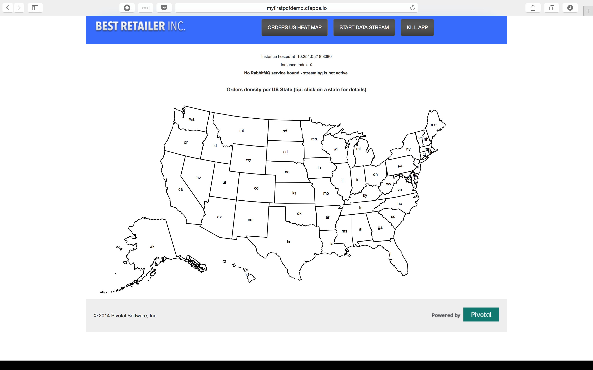

= Lab 1 - From Zero to Pushing Your First Application

== Target

. If you haven't already, download the latest release of the Cloud Foundry CLI from https://github.com/cloudfoundry/cli/releases for your operating system and install it.

. Set the API target for the CLI: (set appropriate end point for your environment)
+
----
$ cf api https://api.run.pivotal.io --skip-ssl-validation
----

. Login to Pivotal Cloudfoundry:
+
----
$ cf login
----
+
Follow the prompts

== Push It!

. Change to the _cf-demo_ sample application directory:
+
----
$ cd $BOOTCAMP_HOME/cf-demo
----

. Push the application!
+
----
$ cf push
----
+
You should see output similar to the following listing. Take a look at the listing callouts for a play-by-play of what's happening:
+
====
----
Using manifest file /Users/kartiklunkad/Documents/PCF-Workshop-101/cf-demo/manifest.yml<1>

Creating app myfirstpcfdemo in org Northeast / Canada / space kartik as klunkad@pivotal.io...<2>
OK

Creating route myfirstpcfdemo.cfapps.io...<3>
OK

Binding myfirstpcfdemo.cfapps.io to myfirstpcfdemo...<4>
OK

Uploading myfirstpcfdemo...<5>
Uploading app files from: /Users/kartiklunkad/Documents/PCF-Workshop-101/cf-demo/target/pcfdemo.war
Uploading 565.6K, 64 files
Done uploading               
OK

Starting app myfirstpcfdemo in org Northeast / Canada / space kartik as klunkad@pivotal.io...<6>
Creating container
Successfully created container
Downloading app package...
Downloaded app package (8.4M)
Staging...
-----> Java Buildpack Version: 9383db1 | https://github.com/cloudfoundry/java-buildpack#9383db1
-----> Downloading Open Jdk JRE 1.8.0_73 from https://download.run.pivotal.io/openjdk/trusty/x86_64/openjdk-1.8.0_73.tar.gz (1.5s)
       Expanding Open Jdk JRE to .java-buildpack/open_jdk_jre (1.0s)<7>
-----> Downloading Open JDK Like Memory Calculator 2.0.1_RELEASE from https://download.run.pivotal.io/memory-calculator/trusty/x86_64/memory-calculator-2.0.1_RELEASE.tar.gz (0.0s)
       Memory Settings: -Xmx382293K -XX:MaxMetaspaceSize=64M -Xms382293K -XX:MetaspaceSize=64M -Xss995K
-----> Downloading Spring Auto Reconfiguration 1.10.0_RELEASE from https://download.run.pivotal.io/auto-reconfiguration/auto-reconfiguration-1.10.0_RELEASE.jar (0.0s)
       Modifying /WEB-INF/web.xml for Auto Reconfiguration
-----> Downloading Tomcat Instance 8.0.32 from https://download.run.pivotal.io/tomcat/tomcat-8.0.32.tar.gz (0.2s)
       Expanding Tomcat Instance to .java-buildpack/tomcat (0.1s)
-----> Downloading Tomcat Lifecycle Support 2.5.0_RELEASE from https://download.run.pivotal.io/tomcat-lifecycle-support/tomcat-lifecycle-support-2.5.0_RELEASE.jar (0.0s)
-----> Downloading Tomcat Logging Support 2.5.0_RELEASE from https://download.run.pivotal.io/tomcat-logging-support/tomcat-logging-support-2.5.0_RELEASE.jar (0.0s)
-----> Downloading Tomcat Access Logging Support 2.5.0_RELEASE from https://download.run.pivotal.io/tomcat-access-logging-support/tomcat-access-logging-support-2.5.0_RELEASE.jar (0.0s)
Exit status 0
Staging complete
Uploading droplet, build artifacts cache...
Uploading droplet...
Uploading build artifacts cache...
Uploaded build artifacts cache (53.5M)
Uploaded droplet (60.7M)<8>
Uploading complete

0 of 1 instances running, 1 starting
1 of 1 instances running

App started

OK

App myfirstpcfdemo was started using this command `CALCULATED_MEMORY=$($PWD/.java-buildpack/open_jdk_jre/bin/java-buildpack-memory-calculator-2.0.1_RELEASE -memorySizes=metaspace:64m.. -memoryWeights=heap:75,metaspace:10,native:10,stack:5 -memoryInitials=heap:100%,metaspace:100% -totMemory=$MEMORY_LIMIT) &&  JAVA_HOME=$PWD/.java-buildpack/open_jdk_jre JAVA_OPTS="-Djava.io.tmpdir=$TMPDIR -XX:OnOutOfMemoryError=$PWD/.java-buildpack/open_jdk_jre/bin/killjava.sh $CALCULATED_MEMORY -Daccess.logging.enabled=false -Dhttp.port=$PORT" exec $PWD/.java-buildpack/tomcat/bin/catalina.sh run`<9>

Showing health and status for app myfirstpcfdemo in org Northeast / Canada / space kartik as klunkad@pivotal.io...<10>
OK

requested state: started
instances: 1/1
usage: 512M x 1 instances
urls: myfirstpcfdemo.cfapps.io
last uploaded: Tue Mar 22 02:58:56 UTC 2016
stack: cflinuxfs2
buildpack: https://github.com/cloudfoundry/java-buildpack

     state     since                    cpu    memory         disk         details   
#0   running   2016-03-21 10:59:35 PM   0.0%   692K of 512M   1.3M of 1G     

----
<1> The CLI is using a manifest to provide necessary configuration details such as application name, memory to be allocated, and path to the application artifact.
Take a look at `manifest.yml` to see how.
<2> In most cases, the CLI indicates each Cloud Foundry API call as it happens.
In this case, the CLI has created an application record for _Workshop_ in your assigned space.
<3> All HTTP/HTTPS requests to applications will flow through Cloud Foundry's front-end router called http://docs.cloudfoundry.org/concepts/architecture/router.html[(Go)Router].
<4> Now the CLI is _binding_ the created route to the application.
Routes can actually be bound to multiple applications to support techniques such as http://www.mattstine.com/2013/07/10/blue-green-deployments-on-cloudfoundry[blue-green deployments].
<5> The CLI finally uploads the application bits to Pivotal Cloudfoundry. Notice that it's uploading _64 files_! This is because Cloud Foundry actually explodes a ZIP artifact before uploading it for caching purposes.
<6> Now we begin the staging process. The https://github.com/cloudfoundry/java-buildpack[Java Buildpack] is responsible for assembling the runtime components necessary to run the application.
<7> Here we see the version of the JRE that has been chosen and installed.
<8> The complete package of your application and all of its necessary runtime components is called a _droplet_.
Here the droplet is being uploaded to Pivotal Cloudfoundry's internal blobstore so that it can be easily copied to one or more cells.
<9> The CLI tells you exactly what command and argument set was used to start your application.
<10> Finally the CLI reports the current status of your application's health.
====

. Visit the application in your browser by hitting the route that was generated by the CLI:
+

== Interact with App from CF CLI

. Get information about the currently deployed application using CLI apps command:
+
----
$ cf apps
----
+
Note the application name for next steps

. Get information about running instances, memory, CPU, and other statistics using CLI instances command
+
----
$ cf app <<app_name>>
----

. Stop the deployed application using the CLI
+
----
$ cf stop <<app_name>>
----

. Delete the deployed application using the CLI
+
----
$ cf delete <<app_name>>
----
