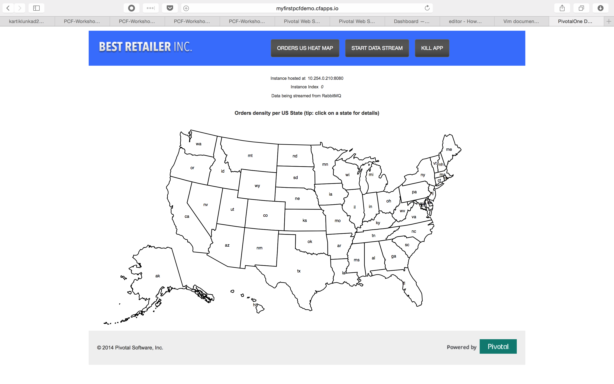
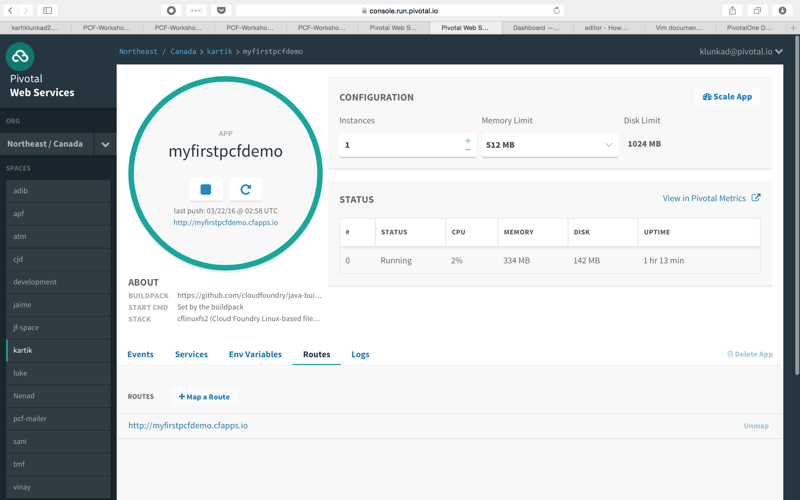
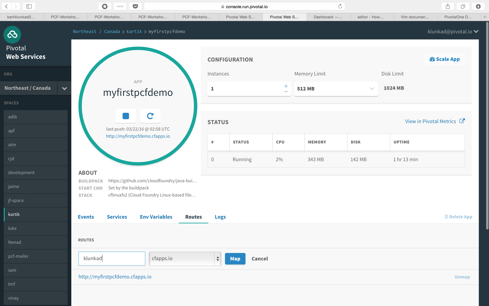
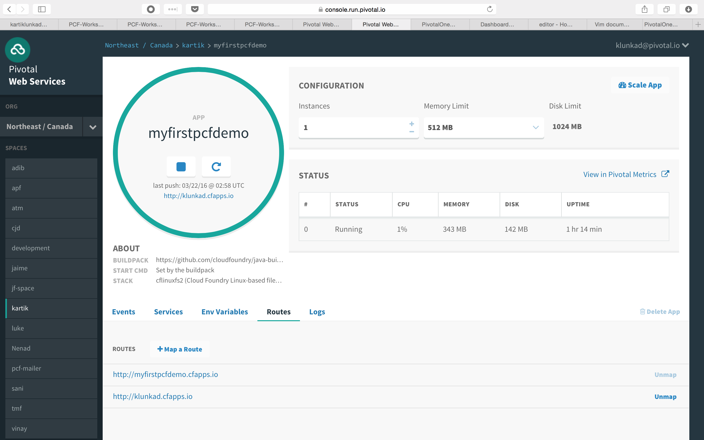
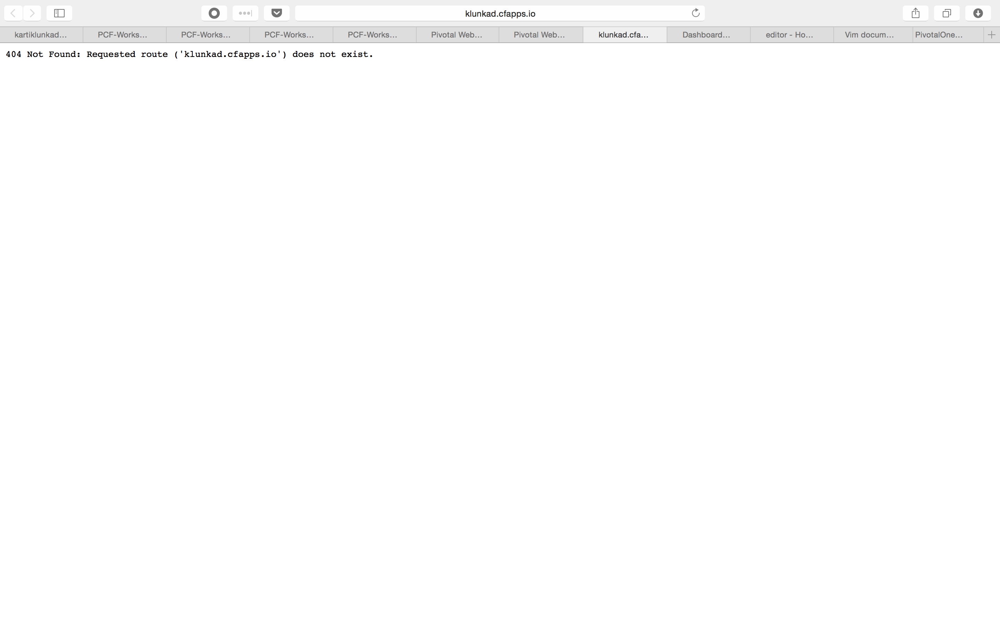

= Lab 3 - Operating your Application

[abstract]
--
Pivotal Cloudfoundry makes the work of performing operations actions, such as scaling, doing a zero-downtime deploy, and managing application health very easy.
In the next two labs we'll explore Pivotal Cloudfoundry operations.
--

== Scale the Application Up

. Now let's increase the number of running application instances to 3.  For this lab you can use the Java, Ruby, or Node.js sample app.  In each of the commands below replace _myfirstpcfdemo_ with the name of your deployed application:
+
----
$ cf scale -i 3 myfirstpcfdemo
Scaling app myfirstpcfdemo in org Northeast / Canada / space kartik as klunkad@pivotal.io...
OK
----
+
In reporting `OK`, the CLI is letting you know that the additional requested instances have been started, but they are not yet necessarily running.

. We can determine how many instances are actually running like this:
+
====
----
$ cf app workshop
Showing health and status for app myfirstpcfdemo in org Northeast / Canada / space kartik as klunkad@pivotal.io...
OK

requested state: started
instances: 3/3
usage: 512M x 3 instances
urls: myfirstpcfdemo.cfapps.io
last uploaded: Tue Mar 22 02:58:56 UTC 2016
stack: cflinuxfs2
buildpack: https://github.com/cloudfoundry/java-buildpack

     state      since                    cpu    memory           disk         details   
#0   running    2016-03-21 11:14:33 PM   0.1%   306.8M of 512M   142M of 1G <1>     
#1   starting   2016-03-22 12:21:06 AM   0.0%   692K of 512M     1.3M of 1G <2>     
#2   starting   2016-03-22 12:21:06 AM   0.1%   302.1M of 512M   142M of 1G 
----
<1> This application instance has completed the startup process and is actually able to accept requests.
<2> This application instance is still starting and will not have any requests routed to it.
====

. Eventually all instances will converge to a running state:
+
----
$ cf app myfirstpcfdemo
Showing health and status for app myfirstpcfdemo in org Northeast / Canada / space kartik as klunkad@pivotal.io...
OK

requested state: started
instances: 3/3
usage: 512M x 3 instances
urls: myfirstpcfdemo.cfapps.io
last uploaded: Tue Mar 22 02:58:56 UTC 2016
stack: cflinuxfs2
buildpack: https://github.com/cloudfoundry/java-buildpack

     state     since                    cpu     memory           disk         details   
#0   running   2016-03-21 11:14:33 PM   0.1%    306.8M of 512M   142M of 1G      
#1   running   2016-03-22 12:21:19 AM   49.9%   306.9M of 512M   142M of 1G      
#2   running   2016-03-22 12:21:19 AM   0.2%    317.4M of 512M   142M of 1G
----

. Revisit the application route in the browser.
Refresh several times.
You should observe the instance index changing as you do so:
+

+
The aforementioned http://docs.cloudfoundry.org/concepts/architecture/router.html[(Go)Router] is applying a random routing algorithm to all of the application instances assigned to this route.
As an instance reaches the `running` state, its http://docs.cloudfoundry.org/concepts/architecture/execution-agent.html[DEA] registers that instance in the routing table assigned to its route by sending a message to Cloud Foundry's message bus.
All (Go)Router instances are subscribed to this channel and register the routes independently.
This makes for very dynamic and rapid reconfiguration!

== Scale the Application Down

. We can scale the application instances back down as easily as we scaled them up, using the same command structure:
+
----
$ cf scale -i 1 myfirstpcfdemo
Scaling app myfirstpcfdemo in org Northeast / Canada / space kartik as klunkad@pivotal.io...
OK
----

. Check the application status again:
+
----
$ cf app myfirstpcfdemo
Showing health and status for app myfirstpcfdemo in org Northeast / Canada / space kartik as klunkad@pivotal.io...
OK

requested state: started
instances: 1/1
usage: 512M x 1 instances
urls: myfirstpcfdemo.cfapps.io
last uploaded: Tue Mar 22 02:58:56 UTC 2016
stack: cflinuxfs2
buildpack: https://github.com/cloudfoundry/java-buildpack

     state     since                    cpu    memory         disk           details   
#0   running   2016-03-21 11:14:33 PM   1.1%   330M of 512M   142.1M of 1G
----
+
As you can see, we're back down to only one instance running, and it is in fact the original index 0 that we started with.

. Confirm that by again revisiting the route in the browser and checking the instance index:
+

== HTTP Routing

There are two ways to discover what routes, or HTTP URLs, are ampped to an application
The first is available via the CLI. Just type:

----
$ cf app myfirstpcfdemo
Showing health and status for app myfirstpcfdemo in org Northeast / Canada / space kartik as klunkad@pivotal.io...
OK

requested state: started
instances: 1/1
usage: 512M x 1 instances
urls: myfirstpcfdemo.cfapps.io
last uploaded: Tue Mar 22 02:58:56 UTC 2016
stack: cflinuxfs2
buildpack: https://github.com/cloudfoundry/java-buildpack

     state     since                    cpu    memory         disk           details   
#0   running   2016-03-21 11:14:33 PM   1.1%   330M of 512M   142.1M of 1G
----

and you'll see the list of routes in the section that says _urls_.

The second way is via the Apps Manager UI.  Click on the _Workshop_ application to view application details.  Select the _Routes_ tab to view a list of mapped routes:

. We can easily add an additional route by clicking on _+ Map a Route_ and supplying the new hostname:
+

. Navigate to the new URL in your browser window.  You should see that same application displayed!
+

. We can just as easily remove a route by clicking on _Unmap_ on the route you wish to remove.
+

+
If you navigate to that URL you'll receive a HTTP 404 response
+

. This is how blue-green deployments are accomplished.
+
image::blue-green.png[]

