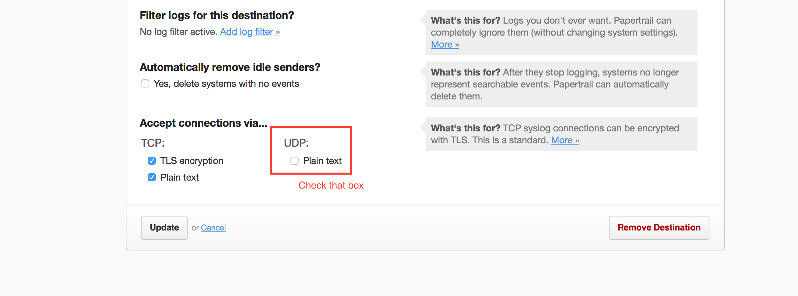

= Lab 4 - Monitoring your Application

[abstract]
--
Pivotal Cloudfoundry makes the work of performing operations actions, such as scaling, doing a zero-downtime deploy, and managing application health very easy.
In the this labs we'll continue to explore Pivotal Cloudfoundry application operations.
--

== Tailing Application Logs

One of the most important enablers of visibility into application behavior is logging.
Effective management of logs has historically been very difficult.
Cloud Foundry's https://github.com/cloudfoundry/loggregator[log aggregation] components simplify log management by assuming responsibility for it.
Application developers need only log all messages to either `STDOUT` or `STDERR`, and the platform will capture these messages.

=== For Developers

Application developers can view application logs using the CF CLI.

. Let's view recent log messages for the application.  For this lab you can use the Java, Ruby, or Node.js sample app.  In each of the commands below replace _workshop_ with the name of your deployed application:
+
----
$ cf logs myfirstpcfdemo --recent
----
+
Here are two interesting subsets of one output from that command:
+
.CF Component Logs
====
----
2016-03-22T00:53:50.50-0400 [STG/0]      OUT Staging complete
2016-03-22T00:53:50.50-0400 [STG/0]      OUT Uploading droplet, build artifacts cache...
2016-03-22T00:53:50.50-0400 [STG/0]      OUT Uploading droplet...
2016-03-22T00:53:50.50-0400 [STG/0]      OUT Uploading build artifacts cache...
2016-03-22T00:53:51.58-0400 [STG/0]      OUT Uploaded build artifacts cache (53.5M)
2016-03-22T00:54:00.03-0400 [STG/0]      OUT Uploaded droplet (60.7M)
2016-03-22T00:54:00.05-0400 [STG/0]      OUT Uploading complete
2016-03-22T00:54:01.39-0400 [CELL/0]     OUT Creating container
2016-03-22T00:54:01.89-0400 [CELL/0]     OUT Successfully created container
2016-03-22T00:54:05.10-0400 [CELL/0]     OUT Starting health monitoring of container----
====
+
.Application Logs
====
----
2016-03-22T00:54:07.89-0400 [APP/0]      OUT [CONTAINER] ing.DataSourceCloudServiceBeanFactoryPostProcessor INFO    Auto-reconfiguring beans of type javax.sql.DataSource
2016-03-22T00:54:07.89-0400 [APP/0]      OUT [CONTAINER] ing.DataSourceCloudServiceBeanFactoryPostProcessor INFO    No beans of type javax.sql.DataSource found. Skipping auto-reconfiguration.
2016-03-22T00:54:07.89-0400 [APP/0]      OUT [CONTAINER] .spring.RabbitCloudServiceBeanFactoryPostProcessor INFO    Auto-reconfiguring beans of type org.springframework.amqp.rabbit.connection.ConnectionFactory
2016-03-22T00:54:07.89-0400 [APP/0]      OUT [CONTAINER] .spring.RabbitCloudServiceBeanFactoryPostProcessor INFO    No beans of type org.springframework.amqp.rabbit.connection.ConnectionFactory found. Skipping auto-reconfiguration.

----
====
+
As you can see, Cloud Foundry's log aggregation components capture both application logs and CF component logs relevant to your application.
These events are properly interleaved based on time, giving you an accurate picture of events as they transpired across the system.

. To get a running ``tail'' of the application logs rather than a dump, simply type:
+
----
$ cf logs myfirstpcfdemo
----
+
You can try various things like refreshing the browser and triggering stop/start events to see logs being generated.

=== For Operators (OPTIONAL)

Application operators will also enjoy commands like `cf logs`, but are often interested in long-term retention, indexing, and analysis of logs as well.
Cloud Foundry currently only provides short-term retention of logs.
To meet these needs, Cloud Foundry provides the ability to http://docs.cloudfoundry.org/devguide/services/log-management.html[drain logs to third-party providers.]

In this section, we'll drain logs to a very simple provider called https://papertrailapp.com[Papertrail].

. Visit https://papertrailapp.com and create a free account.

. Login to your account and add your first system:
+
image::papertrail_1.png[]

. Click on ``Other'':
+
image::papertrail_2.png[]

. Choose ``I use Cloud Foundry'' and provide a name:
+

. Note the URL + Port assigned to your application:
+
image::papertrail_4.png[]

. Click Edit Settings -> Click on the URL + Port assigned -> Enable Plain text 
+

+

+

. We'll use a Cloud Foundry http://docs.cloudfoundry.org/devguide/services/user-provided.html[user-provided service instance] to create the log drain for our application using the URL + Port provided by Papertrail:
+
----
$ cf cups workshop-logs -l syslog://logs2.papertrailapp.com:43882
Creating user provided service workshop-logs in org TELCO / space gammon as admin...
OK
----

. We bind that service instance into our application
+
----
$ cf bind-service workshop workshop-logs
Binding service workshop-logs to app workshop in org TELCO / space gammon as admin...
OK
TIP: Use 'cf restage workshop' to ensure your env variable changes take effect
----

. We'll use a `cf restart` rather than `cf restage` to make the binding take effect:
+
----
$ cf restart workshop
----

. Navigate to the home Dashboard of the Papertrail app and select your 'system' to see log events immediately flowing to the log viewing page:
+
image::papertrail_5.png[]

You can see how to connect to other third-party log management systems in the http://docs.cloudfoundry.org/devguide/services/log-management-thirdparty-svc.html[Cloud Foundry documentation].

== Health Management

Cloud Foundry's http://docs.cloudfoundry.org/concepts/architecture/#hm9k[Heatlh Manager] actively monitors the health of our application processes and will restart them should they crash.

. If you don't have one already running, start a log tail for `workshop`.  Alternatively, you could view the logs using the papertrail app.
+
----
$ cf logs myfirstpcfdemo
----

. If you do not have more than one application instance running, execute the scale command to scale to 2 or more application instances.  Visit the application in the browser, and click on the ``Kill Switch'' button. This button will trigger a JVM exit with an error code (`System.exit(1)`), causing the Health Manager to observe an application instance crash:
+

. After clicking the kill switch a couple of interesting things should happen.
If you're paying attention to the log tail, you'll see some interesting log messages fly by:
+
====
----
2016-03-22T01:11:19.93-0400 [RTR/0]      OUT myfirstpcfdemo.cfapps.io - [22/03/2016:05:11:19 +0000] "GET /getData?state=undefined HTTP/1.1" 502 0 67 "http://myfirstpcfdemo.cfapps.io/" "Mozilla/5.0 (Macintosh; Intel Mac OS X 10_10_5) AppleWebKit/600.8.9 (KHTML, like Gecko) Version/8.0.8 Safari/600.8.9" 10.10.66.45:17667 x_forwarded_for:"98.109.42.52" x_forwarded_proto:"http" vcap_request_id:472ba37e-bc33-4987-4fb9-19a3aaee5909 response_time:0.493017518 app_id:4b211168-6e5c-4321-b71f-2cc59692da90
2016-03-22T01:11:19.93-0400 [RTR/1]      OUT myfirstpcfdemo.cfapps.io - [22/03/2016:05:11:18 +0000] "GET /getHeatMap HTTP/1.1" 502 0 67 "http://myfirstpcfdemo.cfapps.io/" "Mozilla/5.0 (Macintosh; Intel Mac OS X 10_10_5) AppleWebKit/600.8.9 (KHTML, like Gecko) Version/8.0.8 Safari/600.8.9" 10.10.66.45:5102 x_forwarded_for:"98.109.42.52" x_forwarded_proto:"http" vcap_request_id:8bd38d0b-0dd7-4fc6-4061-6a898869c9e0 response_time:1.673443505 app_id:4b211168-6e5c-4321-b71f-2cc59692da90
2016-03-22T01:11:19.96-0400 [API/2]      OUT App instance exited with guid 4b211168-6e5c-4321-b71f-2cc59692da90 payload: {"instance"=>"66531e1b-2949-4336-7dbf-031dea5e2575", "index"=>1, "reason"=>"CRASHED", "exit_description"=>"2 error(s) occurred:\n\n* 2 error(s) occurred:\n\n* Exited with status 255\n* cancelled\n* cancelled", "crash_count"=>1, "crash_timestamp"=>1458623479925083151, "version"=>"b0069017-35fd-4bb0-9733-cc13603faba0"}

====

. Wait a few seconds...  By this time you should have noticed some additional interesting events in the logs:
+
====
----
2016-03-22T01:11:20.16-0400 [CELL/1]     OUT Creating container
2016-03-22T01:11:20.67-0400 [CELL/1]     OUT Successfully created container
2016-03-22T01:11:20.76-0400 [RTR/4]      OUT myfirstpcfdemo.cfapps.io - [22/03/2016:05:11:20 +0000] "GET /getHeatMap HTTP/1.1" 200 0 2663 "http://myfirstpcfdemo.cfapps.io/" "Mozilla/5.0 (Macintosh; Intel Mac OS X 10_10_5) AppleWebKit/600.8.9 (KHTML, like Gecko) Version/8.0.8 Safari/600.8.9" 10.10.2.230:25208 x_forwarded_for:"98.109.42.52" x_forwarded_proto:"http" vcap_request_id:f6bc4272-c93a-43e0-46c0-3dc1fdd91b2c response_time:0.003706363 app_id:4b211168-6e5c-4321-b71f-2cc59692da90
2016-03-22T01:11:20.77-0400 [RTR/1]      OUT myfirstpcfdemo.cfapps.io - [22/03/2016:05:11:20 +0000] "GET /getData?state=undefined HTTP/1.1" 200 0 3 "http://myfirstpcfdemo.cfapps.io/" "Mozilla/5.0 (Macintosh; Intel Mac OS X 10_10_5) AppleWebKit/600.8.9 (KHTML, like Gecko) Version/8.0.8 Safari/600.8.9" 10.10.66.45:5102 x_forwarded_for:"98.109.42.52" x_forwarded_proto:"http" vcap_request_id:7d63d0d7-e6b6-4073-61d2-b5763c9a6712 response_time:0.002987647 app_id:4b211168-6e5c-4321-b71f-2cc59692da90
2016-03-22T01:11:21.75-0400 [RTR/4]      OUT myfirstpcfdemo.cfapps.io - [22/03/2016:05:11:21 +0000] "GET /getData?state=undefined HTTP/1.1" 200 0 3 "http://myfirstpcfdemo.cfapps.io/" "Mozilla/5.0 (Macintosh; Intel Mac OS X 10_10_5) AppleWebKit/600.8.9 (KHTML, like Gecko) Version/8.0.8 Safari/600.8.9" 10.10.2.230:25208 x_forwarded_for:"98.109.42.52" x_forwarded_proto:"http" vcap_request_id:a4801568-945d-40ff-69b6-527316be7707 response_time:0.002940021 app_id:4b211168-6e5c-4321-b71f-2cc59692da90

====

. Revisiting the *HOME PAGE* of the application (don't simply refresh the browser as you're still on the `/killSwitch` endpoint and you'll just kill the application again!) and you should see a fresh instance started:
+

== Viewing Application _Events_

Cloud Foundry only allows application configuration to be modified via its API.
This gives application operators confidence that all changes to application configuration are known and auditable.
It also reduces the number of causes that must be considered when problems arise.

All application configuration changes are recorded as _events_.
These events can be viewed via the Cloud Foundry API, and viewing is facilitated via the CLI.

Take a look at the events that have transpired so far for our deployment of `workshop`:

====
----
$ cf events myfirstpcfdemo
Getting events for app myfirstpcfdemo in org Northeast / Canada / space kartik as admin...

time                          event                 actor      description
2015-08-11T08:58:57.00-0400   app.crash             workshop   index: 0, reason: CRASHED, exit_description: app instance exited, exit_status: 255  <6>
2015-08-11T08:58:17.00-0400   audit.app.update      admin      instances: 5 <5>
2015-08-11T08:58:11.00-0400   audit.app.update      admin
2015-08-11T08:58:11.00-0400   audit.app.map-route   admin
2015-08-11T08:54:35.00-0400   audit.app.update      admin      state: STARTED  <4>
2015-08-11T08:54:22.00-0400   audit.app.update      admin  <3>
2015-08-11T08:54:22.00-0400   audit.app.map-route   admin  <2>
2015-08-11T08:54:19.00-0400   audit.app.create      admin      instances: 1, memory: 512, state: STOPPED, environment_json: PRIVATE DATA HIDDEN <1>
----
<1> Events are sorted newest to oldest, so we'll start from the bottom.
Here we see the `app.create` event, which created our application's record and stored all of its metadata (e.g. `memory: 512`).
<2> The `app.map-route` event records the incoming request to assign a route to our application.
<3> This `app.update` event records the resulting change to our applications metadata.
<4> This `app.update` event records the change of our application's state to `STARTED`.
<5> Remember scaling the application up? This `app.update` event records the metadata change `instances: 5`.
<6> And here's the `app.crash` event recording that we encountered a crash of an application instance.
====

. Let's explicitly ask for the application to be stopped:
+
----
$ cf stop myfirstpcfdemo
Stopping app myfirstpcfdemo in org Northeast / Canada / space kartik as admin...
OK
----

. Now, examine the additional `app.update` event:
+
----
$ cf events myfirstpcfdemo
Getting events for app myfirstpcfdemo in org Northeast / Canada / space kartik as admin...

time                          event                 actor      description
2015-08-11T09:01:35.00-0400   audit.app.update      admin      state: STOPPED
2015-08-11T08:58:57.00-0400   app.crash             workshop   index: 0, reason: CRASHED, exit_description: app instance exited, exit_status: 255
2015-08-11T08:58:17.00-0400   audit.app.update      admin      instances: 5
2015-08-11T08:58:11.00-0400   audit.app.update      admin
2015-08-11T08:58:11.00-0400   audit.app.map-route   admin
2015-08-11T08:54:35.00-0400   audit.app.update      admin      state: STARTED
2015-08-11T08:54:22.00-0400   audit.app.update      admin
2015-08-11T08:54:22.00-0400   audit.app.map-route   admin
2015-08-11T08:54:19.00-0400   audit.app.create      admin      instances: 1, memory: 512, state: STOPPED, environment_json: PRIVATE DATA HIDDEN
----

. Start the application again:
+
----
$ cf start myfirstpcfdemo
Starting app myfirstpcfdemo in org Northeast / Canada / space kartik as admin...

0 of 5 instances running, 5 starting
2 of 5 instances running, 3 starting

App started

OK

App workshop was started using this command `JAVA_HOME=$PWD/.java-buildpack/open_jdk_jre JAVA_OPTS="-Djava.io.tmpdir=$TMPDIR -XX:OnOutOfMemoryError=$PWD/.java-buildpack/open_jdk_jre/bin/killjava.sh -Xmx382293K -Xms382293K -XX:MaxMetaspaceSize=64M -XX:MetaspaceSize=64M -Xss995K -Djava.security.egd=file:///dev/urandom -Daccess.logging.enabled=false -Dhttp.port=$PORT" $PWD/.java-buildpack/tomcat/bin/catalina.sh run`

Showing health and status for app myfirstpcfdemo in org Northeast / Canada / space kartik as admin...
OK

requested state: started
instances: 5/5
usage: 512M x 5 instances
urls: workshop-subhepatic-retiredness.vert.fe.gopivotal.com, adam-app.vert.fe.gopivotal.com
last uploaded: Tue Aug 11 12:54:33 UTC 2015
stack: cflinuxfs2
buildpack: java-buildpack=v3.0-offline-https://github.com/cloudfoundry/java-buildpack.git#3bd15e1 java-opts open-jdk-jre=1.8.0_40 spring-auto-reconfiguration=1.7.0_RELEASE tomcat-access-logging-support=2.4.0_RELEASE tomcat-instance=8.0.21 tomcat-lifecycle-support...

     state      since                    cpu    memory           disk           details
#0   starting   2015-08-11 09:02:17 AM   0.0%   435.6M of 512M   144.4M of 1G
#1   running    2015-08-11 09:02:26 AM   0.0%   406.3M of 512M   144.4M of 1G
#2   running    2015-08-11 09:02:27 AM   0.0%   401.2M of 512M   144.4M of 1G
#3   running    2015-08-11 09:02:26 AM   0.0%   403.9M of 512M   144.4M of 1G
#4   starting   2015-08-11 09:02:17 AM   0.0%   398.2M of 512M   144.4M of 1G
----

. And again, view the additional `app.update` event:
+
----
$ cf events myfirstpcfdemo
Getting events for app myfirstpcfdemo in org Northeast / Canada / space kartik as admin...

time                          event                 actor      description
2015-08-11T09:02:17.00-0400   audit.app.update      admin      state: STARTED
2015-08-11T09:01:35.00-0400   audit.app.update      admin      state: STOPPED
2015-08-11T08:58:57.00-0400   app.crash             workshop   index: 0, reason: CRASHED, exit_description: app instance exited, exit_status: 255
2015-08-11T08:58:17.00-0400   audit.app.update      admin      instances: 5
2015-08-11T08:58:11.00-0400   audit.app.update      admin
2015-08-11T08:58:11.00-0400   audit.app.map-route   admin
2015-08-11T08:54:35.00-0400   audit.app.update      admin      state: STARTED
2015-08-11T08:54:22.00-0400   audit.app.update      admin
2015-08-11T08:54:22.00-0400   audit.app.map-route   admin
2015-08-11T08:54:19.00-0400   audit.app.create      admin      instances: 1, memory: 512, state: STOPPED, environment_json: PRIVATE DATA HIDDEN
----
